<!-- PROJECT LOGO -->

<p align="center">
  
  <h3 align="center" >NoteApp</h3>
</p>

<!-- TABLE OF CONTENTS -->
## Table of Contents

* [About the Project](#about-the-project)
  * [Architecture](#architecture)
  * [Components](#components)
  * [Features](#features)
  * [App Screenshots](#app-screenshots)
  * [App icons](#app-icons)
  * [Libraries Used](#libraries-used)
* [Getting Started](#getting-started)
  * [Built With](#built-with)
  * [Prerequisites](#prerequisites)
* [Versioning](#versioning)
  * [Auto-versioning](#auto-versioning)
* [Contact](#contact)

<!-- ABOUT THE PROJECT -->
## About The Project

This is simple notes app. User creates notes. These notes are kept in the internal memory and listed to the user. The user can delete or edit the listed notes.

<!-- Architecture -->
### Architecture

Android clean architecture was used for this project. It can be installed with clean architecture MVVM or MVP. In this project, this structure was used together with MVVM. clean architecture works in the simplest way in (Figure 1).

![clean architecture_dependencies][clean-architecture_dependencies]
<h6 align="center" >(Figure 1)</h6>

***

As seen in (Figure 1), it consists of 3 main layers. Of these main layers, Presentation and Data layers are dependency on the Domain layer. 
At the same time, all of these 3 main layers are one module. For a modular project, each module in the project contains these 3 main layers within itself.
In this project, only one module was created. Modules can be added with new features. This architecture is conducive to extensibility. You can examine the above-mentioned clean architecture in more detail in (Figure 2) and (Figure 3).

***

![mvvm clean architecture suspend func][mvvm-clean-architecture-suspend-func]
<h6 align="center" >(Figure 2)</h6>

<p align="center">
  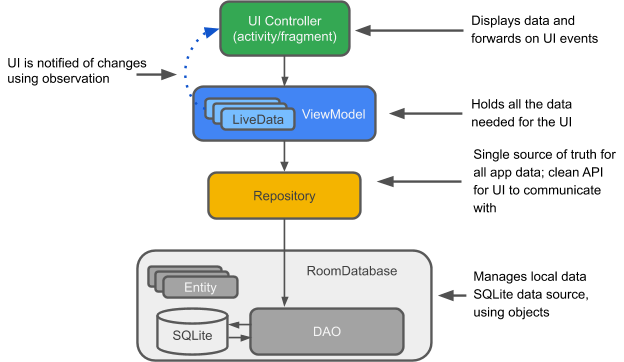
  <h6 align="center" >(Figure 3)</h6>
</p>


<!-- Components -->
### Components

1. __Navigation Components__ - Navigation component helps you implement navigation, from simple button clicks to more complex patterns, such as app bars and the navigation drawer. The Navigation component also ensures a consistent and predictable user experience by adhering to an established set of principles.

2. __Android Room Persistence__ - The Room persistence library provides an abstraction layer over SQLite to allow fluent database access while harnessing the full power of SQLite. Room provides compile time checks of SQLite statements and can return RxJava, Flowable and LiveData observables.

3. __Kotlin Coroutines__ - A coroutine is a concurrency design pattern that you can use on Android to simplify code that executes asynchronously. On Android, coroutines help to manage long-running tasks that might otherwise block the main thread and cause your app to become unresponsive.

4. __ViewModel__ - It manages UI-related data in a lifecycle-conscious way. It stores UI-related data that isn't destroyed on app rotations.

5. __LiveData__ - It notifies views of any database changes. Use LiveData to build data objects that notify views when the underlying database changes.

6. __Kotlin__ - Kotlin is a modern statically typed programming language used by over 60% of professional Android developers that helps boost productivity, developer satisfaction, and code safety.

          It also uses RecyclerView with DiffUtill to improves overall app performances

<!-- Features -->
### Features
1. Save Note In a Local db
2. Update
3. Delete
4. Swipe To Delete
5. Undo Delete Operation
6. Upload Image From Url and Stores in local db with a note
7. RecyclerView Animations
8. Edittext Animations
9. Fragment Transition Animations 
10. Splash screen
11. Landscape and portrait orientation support
12. 2 different language support in Turkish / English

<!-- App Screenshots -->
### App Screenshots

<p align="middle">
  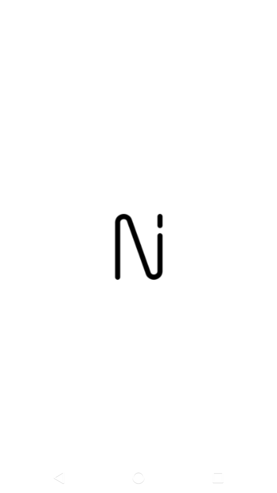
  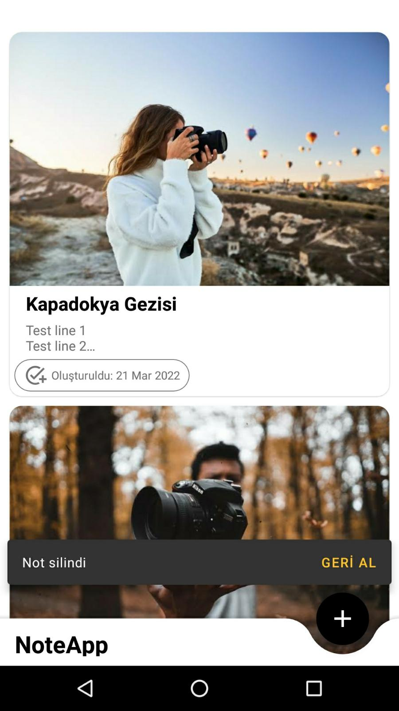
  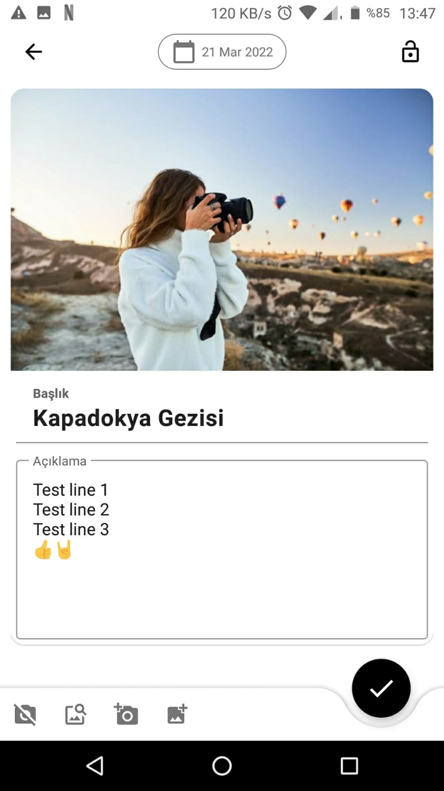
  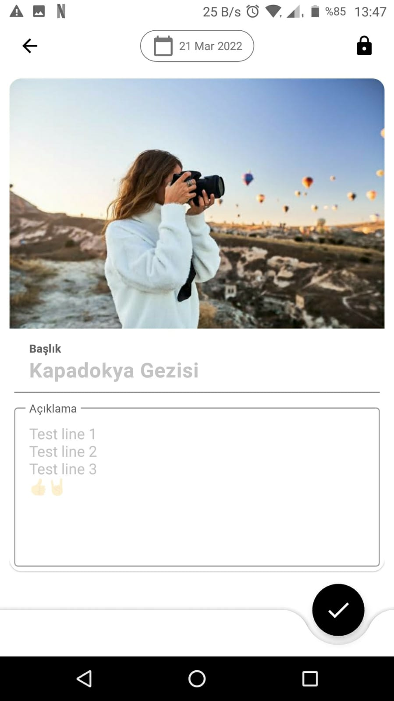
</p>

*** 
<p align="middle">
  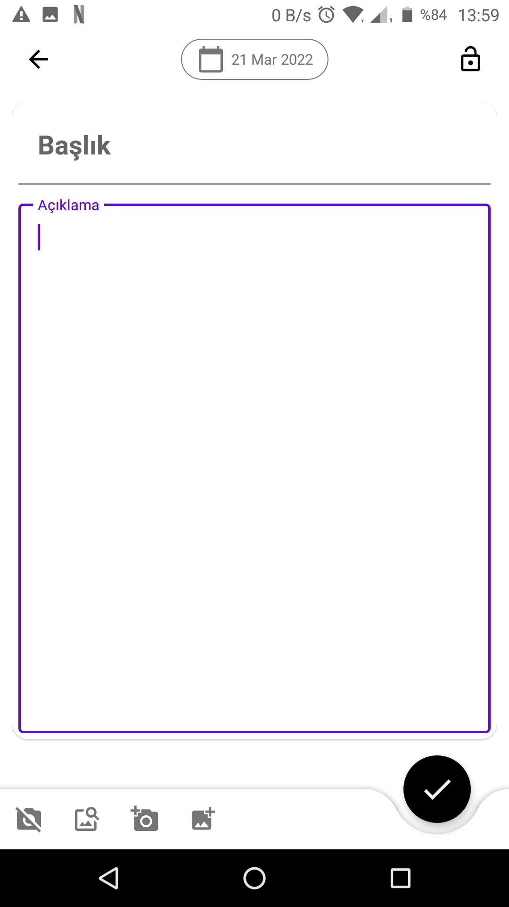
  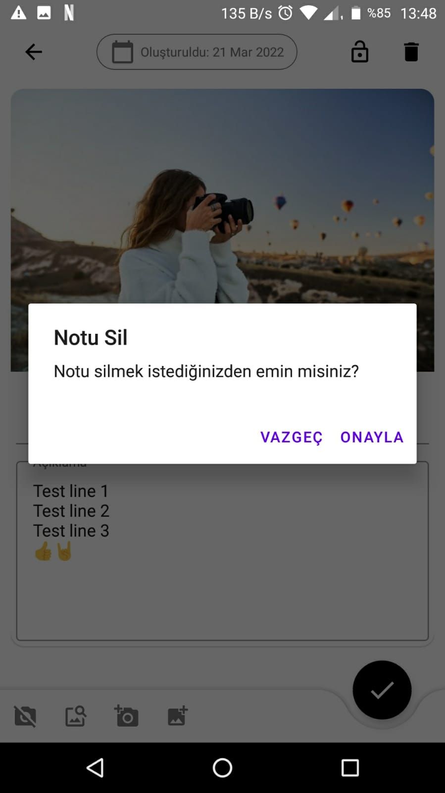
  
  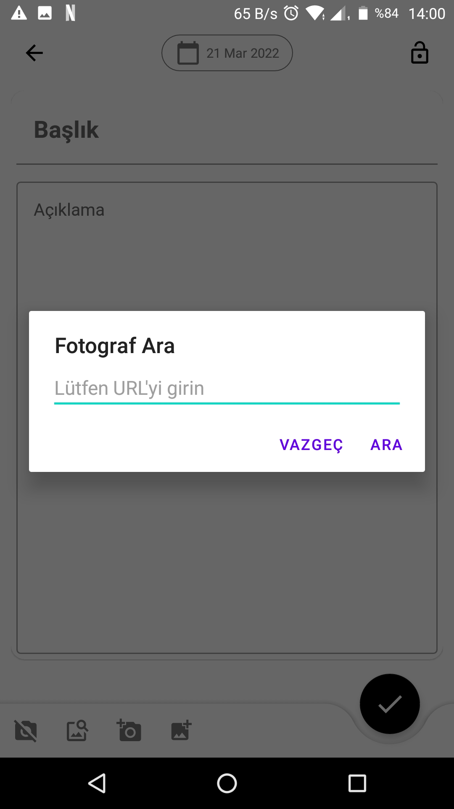
</p>

***

<p align="middle">
  
  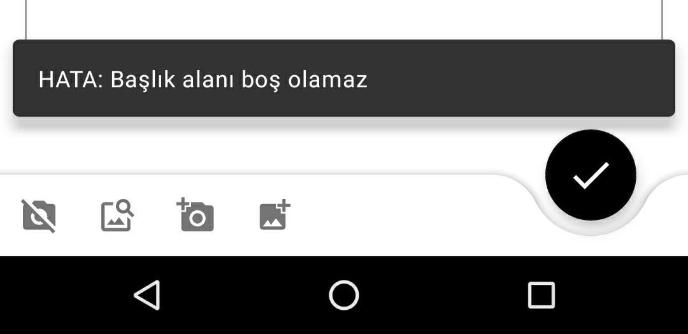
  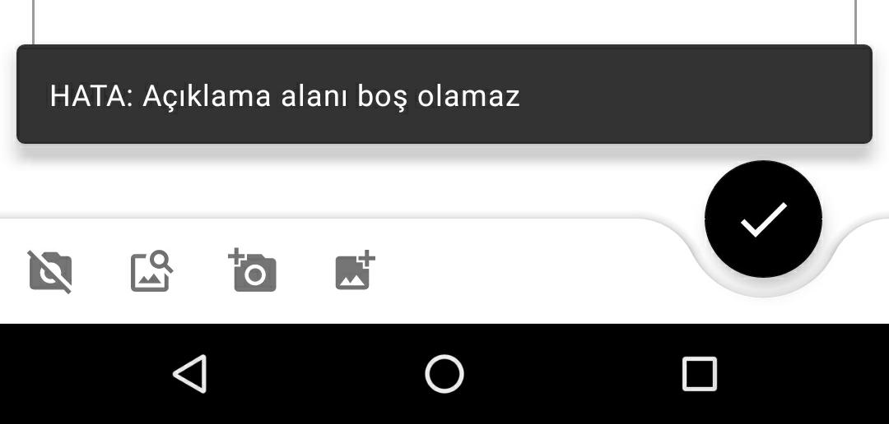
  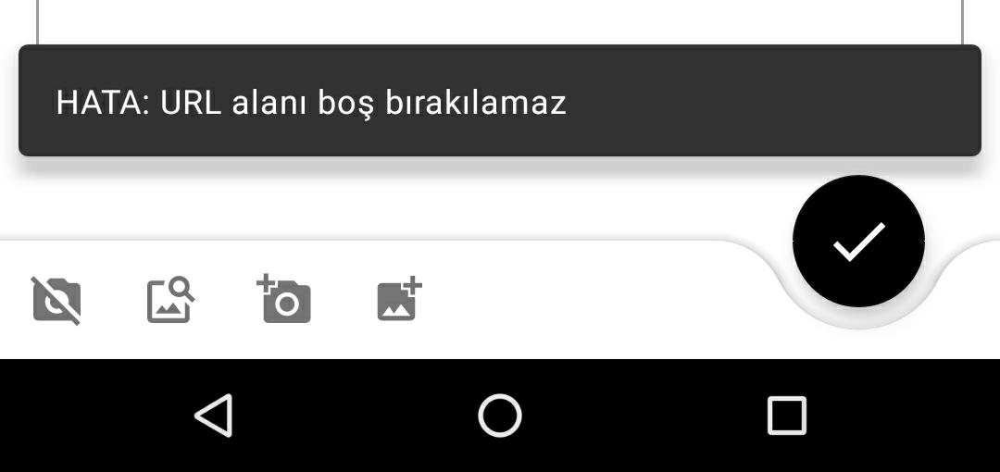
</p>

***

<p align="middle">
  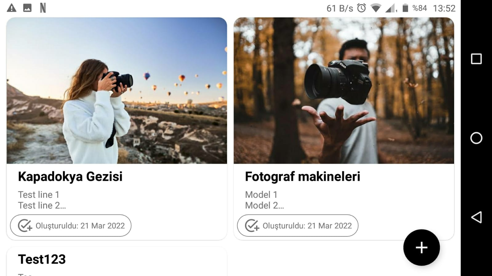
  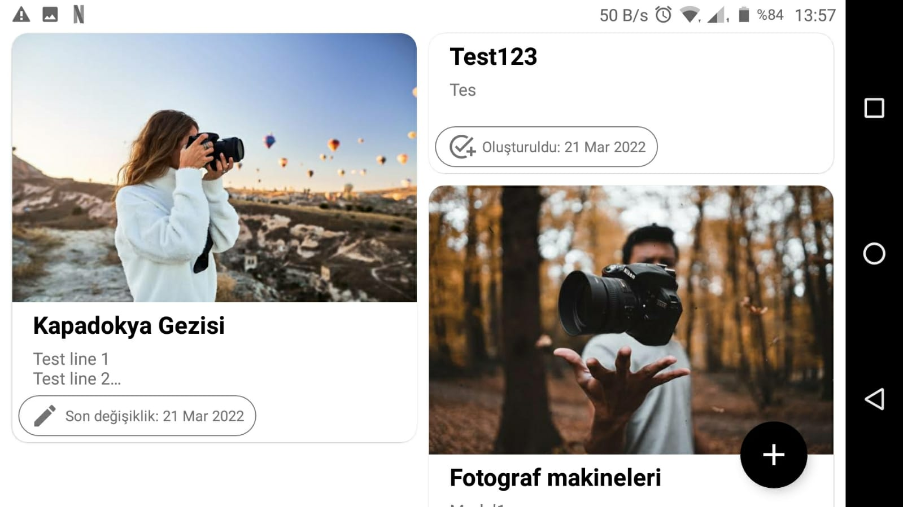
  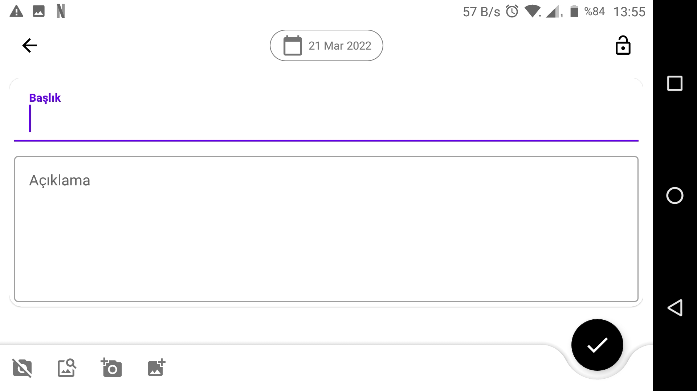
</p>

<!-- App icons -->
### App icons

<table>
  <tr>
    <th></th>
    <th>Means / action</th>
  </tr>
  <tr>
    <th></th>
    <td>Redirects to the relevant fragment to add a new note</td>
  </tr>
  <tr>
    <th></th>
    <td>Indicates that the corresponding note was not updated after it was created</td>
  </tr>
  <tr>
    <th></th>
    <td>Returns from fragment</td>
  </tr>
  <tr>
    <th></th>
    <td>indicates that the field contains date information</td>
  </tr>
  <tr>
    <th></th>
    <td>Saves the changes made for the active note</td>
  </tr>
  <tr>
    <th></th>
    <td>Deletes the active note</td>
  </tr>
  <tr>
    <th></th>
    <td>Indicates that the swipe to delete operation has started</td>
  </tr>
  <tr>
    <th></th>
    <td>indicates that the corresponding note was updated at least once after it was created</td>
  </tr>
  <tr>
    <th></th>
    <td>Indicates that the editable feature of the active note is disabled</td>
  </tr>
  <tr>
    <th></th>
    <td>Indicates that the editable feature of the active note is active</td>
  </tr>
  <tr>
    <th></th>
    <td>Initiates image download flow via URL</td>
  </tr>
  <tr>
    <th></th>
    <td>Removes the image attached to the note. It also replaces when the image cannot be loaded for some reason.</td>
  </tr>
  <tr>
    <th></th>
    <td>Starts the flow of taking pictures from the camera (this feature is not supported in the latest version)</td>
  </tr>
  <tr>
    <th></th>
    <td>Starts the image selection flow from the gallery (this feature is not supported in the latest version)</td>
  </tr>
</table>

***

<!-- Libraries Used -->
## Libraries Used

<ul>
<li><a href="https://developer.android.com/topic/libraries/architecture/room" target="_blank">Room</a></li>
<li><a href="https://developer.android.com/training/dependency-injection/hilt-android" target="_blank">Dagger - Hilt</a></li>
<li><a href="https://bumptech.github.io/glide/" target="_blank">Glide</a></li>
<li><a href="https://developer.android.com/guide/topics/ui/splash-screen" target="_blank">Splashscreen</a></li>
<li><a href="https://developer.android.com/kotlin/coroutines" target="_blank">Coroutines</a></li>
<li><a href="https://material.io/develop/android/docs/getting-started/" target="_blank">Material library</a></li>
<li><a href="https://developer.android.com/guide/navigation/navigation-getting-started" target="_blank">Navigation Component</a></li>
<li><a href="https://truth.dev/" target="_blank">Yruth</a></li>
<li><a href="https://https://developer.android.com/training/testing/espresso" target="_blank">Espresso</a></li>
<li><a href="https://junit.org/junit5/" target="_blank">Junit</a></li>
<li><a href="https://developer.android.com/reference/androidx/test/core/app/package-summary" target="_blank">Core-testing</a></li>
</ul>

<!-- Getting Started -->
## Getting Started

The project is available by copying it from the git repository.

<!-- Libraries Used -->
### Built With

- Java 11
- Kotlin Plugin

<!-- Prerequisites -->
### Prerequisites

- A physical or virtual device capable of running an android application so that the application can be tested or run (minSdkVersion = 23).

<!-- Versioning -->
## Versioning

This project follows [semantic versioning](https://semver.org/) standards. There is 3 main identifiers of a version of the software. MAJOR, MINOR and PATCH.
These 3 identifiers are numeric and separated with dot in the version. This means these numeric values should be increased in the following way;
* MAJOR version when backwards incompatible API change
* MINOR version when adding feature to the API with backwards compatibility
* PATCH version when refactor or bug-fix with backwards compatibility

Version code is an integer value. In this project version code is calculated using major, minor and patch numbers. These numbers are defined as a variable in the `app/build.gradle` file.Version code is calculated by multiplying  major by 100_00 and adding minor that multiplied by 1_000 then adding the patch version integer. This way patch number can have a value between [0-999], minor can have a value between [0-99]. Version code can have a value up to 2_100_000_000.

<!-- Auto-versioning -->
### Auto-versioning

This project contains hook scripts to automate the version upgrading process. When you commit some changes it will prompt a screen to ask you the scope of the project. Please input major, minor, patch or ignore depending on your development. Then the scripts will automatically increase the respected version in the `build.gradle` file. Git uses `.git/hooks/` directory for triggering hook scripts. But this directory is not version controlled. So we need to create `.githooks` directory and tell git to check this directory for hook scripts. To do that please run the following command;
```shell script
git config --local core.hooksPath .githooks/
```

<!-- Contact -->
### Contact

- <a href="https://github.com/BatuhanGunes" target="_blank">Github Profile</a>
- [![LinkedIn][linkedin-shield]][linkedin-url]

<!-- MARKDOWN LINKS & IMAGES -->
[linkedin-url]: https://www.linkedin.com/in/batuhan-gunes
[linkedin-shield]: https://img.shields.io/badge/-LinkedIn-black.svg?style=flat-square&logo=linkedin&colorB=555

[clean-architecture_dependencies]: documentation/images/project_architecture/clean_architecture_dependencies.png
[mvvm-clean-architecture-suspend-func]: documentation/images/project_architecture/mvvm_clean_architecture_suspend_func.png
